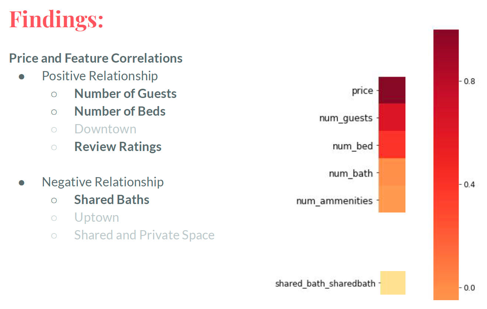
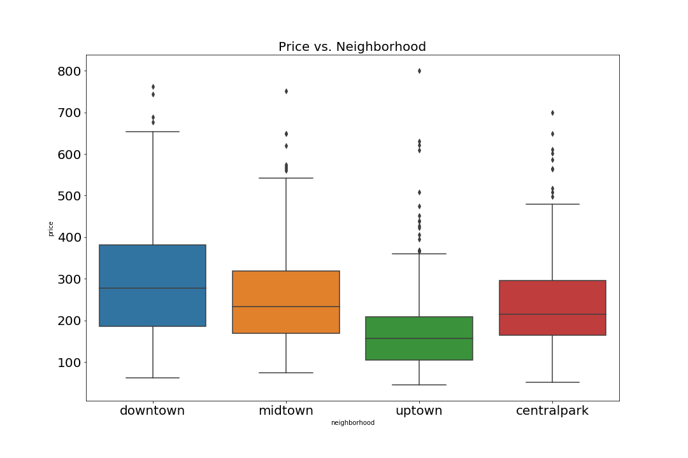

# Predicting Airbnb Rates in Manhattan 

As a New Yorker who both needed a place to stay when I lived outside of Manhattan, and rent out the idle space of my apartment when I lived there, I frequently needed to use Airbnb to find short term housing and rent out my living room just to afford the rent!

## Business Problem/Motivation
This is a dual-sided problem that many New Yorkers and visitors to New York have. So I created a linear regression model that predicts the price of Manhattan Airbnb rentals and show which features of the apartment influences the price. So that hosts can maximize their return on investment on their idle space and guests find the cheapest accommodations given their needs.

## Methodology
**1. Web Scraping**
I utilized Beautiful Soup and Selenium to extract Airbnb Data from Airbnb.com. The listing data included the target, price and features such as number of guests that can be accomodated, number of beds, number of bathrooms, review rating, and neighboorhood of the listing.

**2. Data Cleaning**
I conducted data cleaning of the listing data. The raw data from the listings was pretty messy, I utilized ReGex and other text cleaning techniques to standardize and clean data. After cleaning data I had to remove outliers and set proper bounds on what listings I wanted to look at. Steps I took included removing expensive listings and listings with 0 reviews. I wanted to focus on 'moderately priced' Airbnb rentals that have reviews. 

**3. Exploratory Data Analysis**
I created plots and visualizations to find relationships between features, between the features and plot. Details and charts found below. These relationships between features helped me create interaction terms between features such as total number of stars (number of review * average number of stars).

**4. Model Training and Validation**
After conducting EDA, I split of data to create a train and test set and created a base linear regression model. I ran different regressions, cross validated them with different cuts of the data, and compared the models against each other.  

**5. Testing**
I tested the best performing model: Linear Regression with Lasso Regularization

## Exploratory Data Analysis

**Price Per Night = Accomodations + Location + Listing Type + Reviews**

Removing Outliers:

The dataset has listings that had extremely high prices. One listing cost $4000 per night. Listing like these skew the distribution of the target making predictions less accurate.

After removing these outliers, the distribution is far less skewed, and the predictive power of the model increased.

Correlation Heatmap

Diving deeper into the dataset, I created a correlation heatmap where I found that some features have strong negative and positive correlations with price.

Features such as Number of Guests, Beds, and Review ratings have the strongest positive correlation with price whereas the feature Shared Baths have strongest negative correlation with price. Other important features include neighborhood and listing space type. 

Neighborhood

As you can see from this box plot, the neighborhood influences price as well. Downtown listings are far more expensive than average than uptown listings.

Type of Listing

From this box plot, it shows that listings that rent out the entire space are more expensive than average than private or shared rooms.

Shared Bathrooms

In the last boxplot, shared bathrooms listings are cheaper than average than listings with private bathrooms.

Reviews

In this heatmap, it shows that Reviews are also important in determining how much a host can charge for his/her space and the most important components of Overall Review or Accuracy and Cleanliness, which contribute most to the overall review than any other category.

## Modeling

## Take Aways

## Future Work

